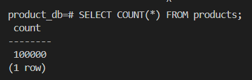
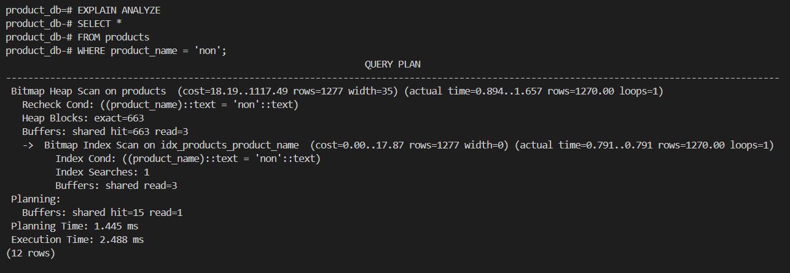

# Analysis Questions
# Fill in the following with your recorded measurements.

1. Initial Data Insertion Time (100,000 rows): ~125 s
2. Query Execution Time (Non-Indexed): 7.938 ms
3. Query Execution Time (Indexed): 2.488 ms
4. Single Row Insertion Time (With Index): 3.105 ms

# Answer the following questions:

1. How did the query execution time change after creating the index? Was it faster or slower? By approximately how much?

- The query execution time became significantly faster after creating the index. Before the index, the query on product_name = 'non' took 7.938 ms using a sequential scan. After creating the index, the same query took only 2.142 ms using a bitmap index scan. This means the query became approximately 3–4 times faster, showing that indexes greatly improve query performance for search operations.

2. Why do you think the query performance changed as you observed?

- The performance improved because the index allows PostgreSQL to quickly locate the rows matching product_name = 'non' without scanning the entire table. Instead of checking all 100,000 rows, the database uses the index to jump directly to the relevant rows, which reduces the amount of data it needs to read and speeds up the query.

3.  What is the trade-off of having an index on a table? (Hint: Compare the initial bulk insertion time with the single row insertion time after the index was created).

- While indexes improve query performance, they come with a trade-off. Maintaining an index slightly slows down data insertion, updates, and deletions because the index must be updated whenever the table changes. For example, bulk inserting 100,000 rows took approximately 125 seconds, while inserting a single row with the index took 3.105 ms. This shows that indexes improve read performance but add a small overhead to write operations.

# Results: 
#1 

#2

#3  

