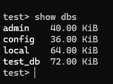
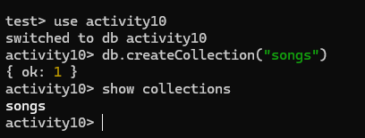
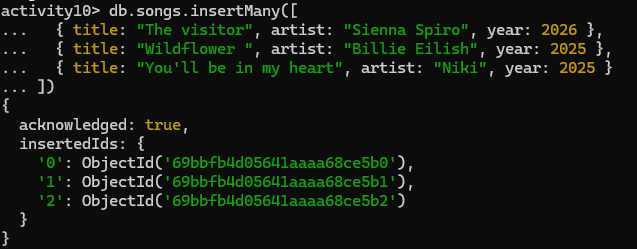
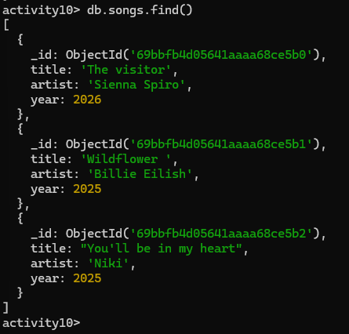
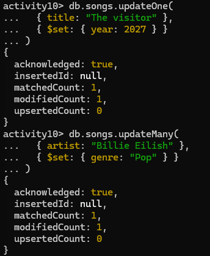
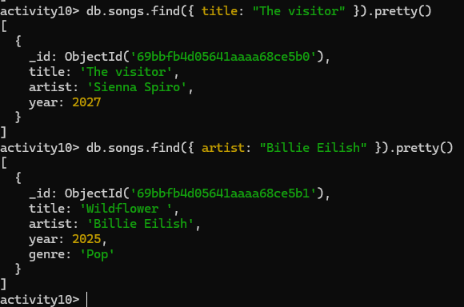
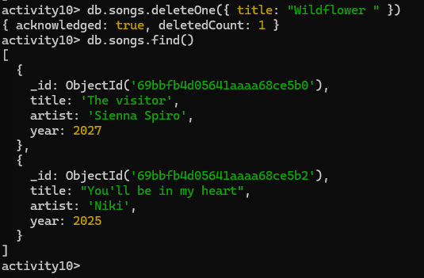

# Activity 10 Solution
## Part 1: Quick Mapping (Postgres -> MongoDB)

**PostgreSQL**

- INSERT INTO posts ...

- SELECT * FROM posts WHERE title='...'	

- UPDATE posts SET title='...' WHERE id=...	

- DELETE FROM posts WHERE id=...

**MongoDB Equivalent**

- db.posts.insertOne({...}) or db.posts.insertMany([...])

- db.posts.find({ title: '...' })

- db.posts.updateOne({ _id: ... }, { $set: { title: '...' } })

- db.posts.deleteOne({ _id: ... })

## Part 2: Hands-on CRUD in MongoDB

**Write the commands you executed and paste screenshots from Mongo shell after each command/block.**

## 2.1 Setup

Commands:

```sql
docker start mongodb
docker exec -it mongodb mongosh
show dbs
```



## 2.2 Create

Commands:

```sql
use activity10
db.createCollection("songs")
show collections
```


## 2.3 Read

Commands:

```sql
db.songs.insertMany([
  { title: "The visitor", artist: "Sienna Spiro", year: 2026 },
  { title: "Wildflower ", artist: "Billie Eilish", year: 2025 },
  { title: "You'll be in my heart", artist: "Niki", year: 2025 }
])
```

```sql
db.songs.find()
```



## 2.4 Update

Commands:

```sql
//updated year
db.songs.updateOne(
  { title: "The visitor" },
  { $set: { year: 2027 } }
)

// Add genre "Pop" to all songs by Billie Eilish
db.songs.updateMany(
  { artist: "Billie Eilish" },
  { $set: { genre: "Pop" } }
)

//Verify updates
db.songs.find({ title: "The visitor" })
db.songs.find({ artist: "Billie Eilish" })
```




## 2.5 Delete

Commands:

```sql
db.songs.deleteOne({ title: "Wildflower " })
db.songs.find()
```


## Part 3: Reflection (3-4 sentences)

1. One thing that feels easier in MongoDB CRUD:

- MongoDB is easier for adding and updating data because you don’t need a fixed table structure. You can quickly add new fields or change existing data. This makes testing and trying out data faster. It feels more flexible than traditional databases like PostgreSQL or MySQL.

2. One thing that was clearer in PostgreSQL CRUD: 

- PostgreSQL is clearer because tables have set columns and rules. You always know what data goes where, which helps prevent mistakes. Using queries with joins also makes it easier to see relationships between data. It feels more organized than MongoDB for structured data.