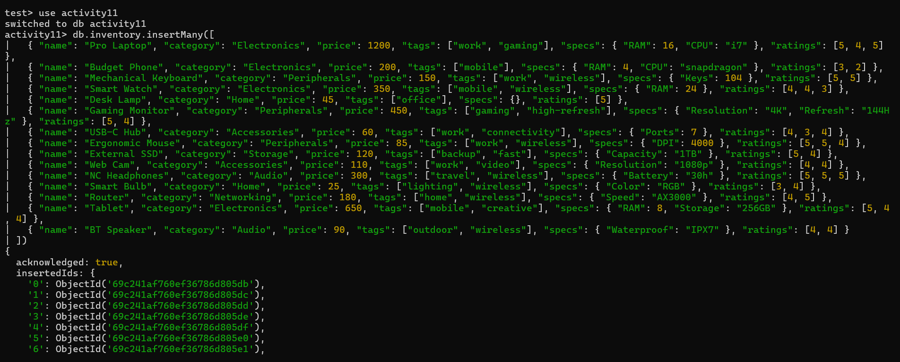
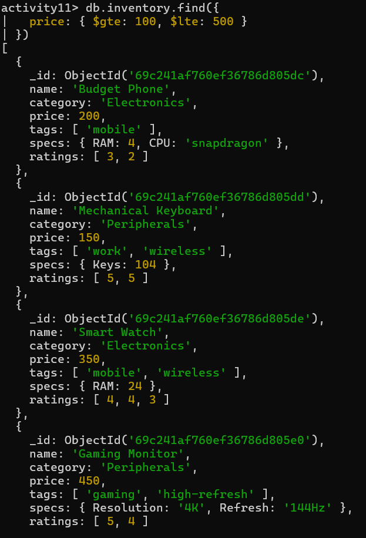
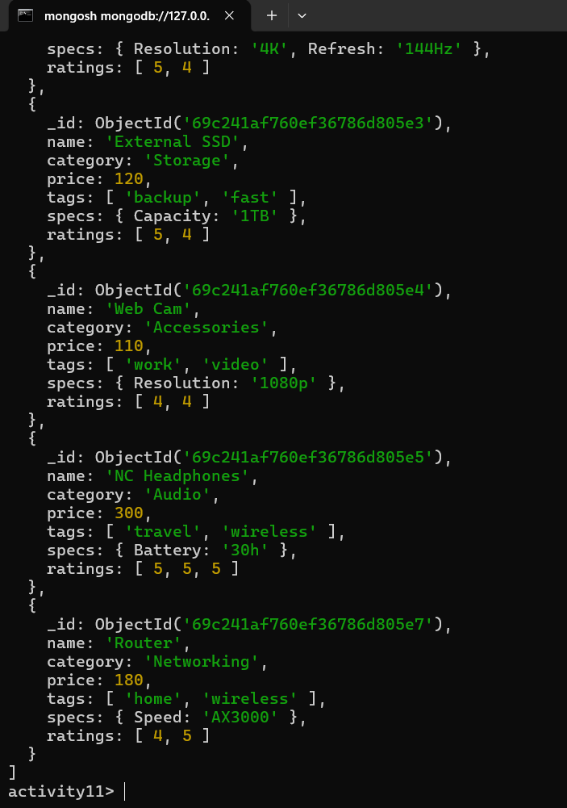
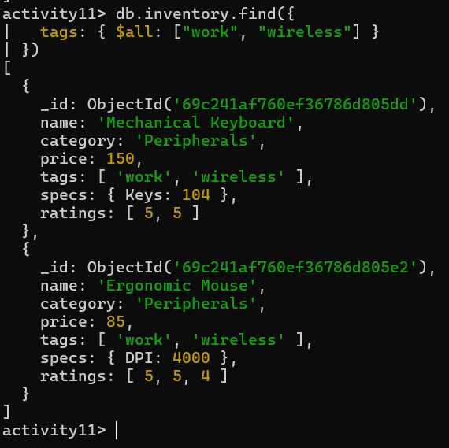
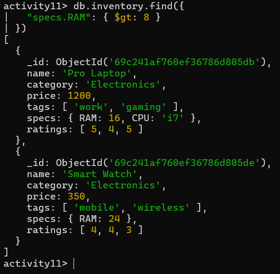
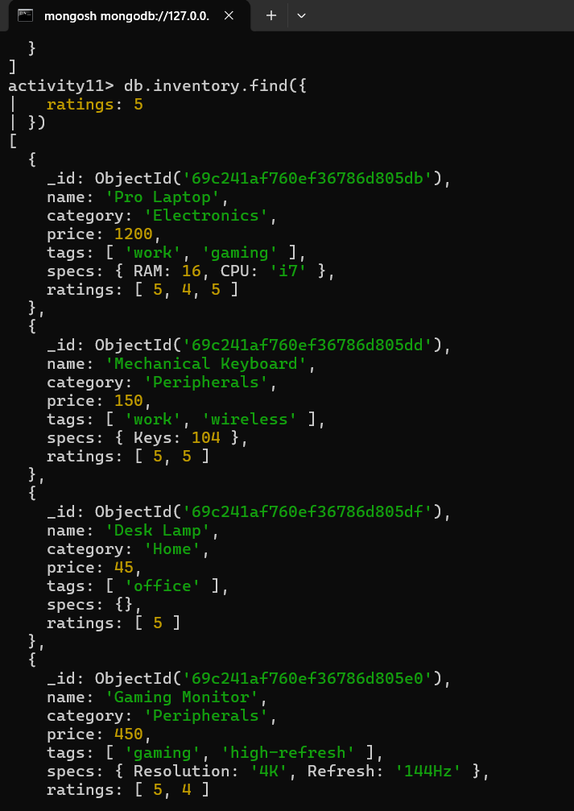

# Activity 11: SQL to MongoDB & Advanced Querying - Answer Template

## Part 1: Relational to Document Modeling
1. Proposed JSON Schema

```sql
// Provide your single document structure here
{
  "_id": "...",
  "title": "Getting Started with MongoDB",
  "body": "MongoDB is a NoSQL database...",
  "created_at": "2026-03-24T10:00:00Z",
  "author": {
    "id": 1,
    "username": "dev_kate",
    "email": "kate@example.com",
    "bio": "Full-stack developer"
  },
  "tags": [
    { "name": "nosql" },
    { "name": "mongodb" }
  ]
}
```

2. Strategic Choices

```sql
Tags: (Embed )
Author: (Embed )
```

3. Justification

- I chose to embed both the tags and the author data to maximize read performance. By including the author's full profile (bio and email) and the tag names directly within the post document, the application can render a complete "Post Detail" page with a single query, completely avoiding the complexity of $lookup joins or multiple round-trips to the database.

## Part 2: Querying with MQL Operators

```sql
// Provide your insert script here
db.inventory.insertMany([
  { "name": "Pro Laptop", "category": "Electronics", "price": 1200, "tags": ["work", "gaming"], "specs": { "RAM": 16, "CPU": "i7" }, "ratings": [5, 4, 5] },
  { "name": "Budget Phone", "category": "Electronics", "price": 200, "tags": ["mobile"], "specs": { "RAM": 4, "CPU": "snapdragon" }, "ratings": [3, 2] },
  { "name": "Mechanical Keyboard", "category": "Peripherals", "price": 150, "tags": ["work", "wireless"], "specs": { "Keys": 104 }, "ratings": [5, 5] },
  { "name": "Smart Watch", "category": "Electronics", "price": 350, "tags": ["mobile", "wireless"], "specs": { "RAM": 24 }, "ratings": [4, 4, 3] },
  { "name": "Desk Lamp", "category": "Home", "price": 45, "tags": ["office"], "specs": {}, "ratings": [5] },
  { "name": "Gaming Monitor", "category": "Peripherals", "price": 450, "tags": ["gaming", "high-refresh"], "specs": { "Resolution": "4K", "Refresh": "144Hz" }, "ratings": [5, 4] },
  { "name": "USB-C Hub", "category": "Accessories", "price": 60, "tags": ["work", "connectivity"], "specs": { "Ports": 7 }, "ratings": [4, 3, 4] },
  { "name": "Ergonomic Mouse", "category": "Peripherals", "price": 85, "tags": ["work", "wireless"], "specs": { "DPI": 4000 }, "ratings": [5, 5, 4] },
  { "name": "External SSD", "category": "Storage", "price": 120, "tags": ["backup", "fast"], "specs": { "Capacity": "1TB" }, "ratings": [5, 4] },
  { "name": "Web Cam", "category": "Accessories", "price": 110, "tags": ["work", "video"], "specs": { "Resolution": "1080p" }, "ratings": [4, 4] },
  { "name": "NC Headphones", "category": "Audio", "price": 300, "tags": ["travel", "wireless"], "specs": { "Battery": "30h" }, "ratings": [5, 5, 5] },
  { "name": "Smart Bulb", "category": "Home", "price": 25, "tags": ["lighting", "wireless"], "specs": { "Color": "RGB" }, "ratings": [3, 4] },
  { "name": "Router", "category": "Networking", "price": 180, "tags": ["home", "wireless"], "specs": { "Speed": "AX3000" }, "ratings": [4, 5] },
  { "name": "Tablet", "category": "Electronics", "price": 650, "tags": ["mobile", "creative"], "specs": { "RAM": 8, "Storage": "256GB" }, "ratings": [5, 4, 4] },
  { "name": "BT Speaker", "category": "Audio", "price": 90, "tags": ["outdoor", "wireless"], "specs": { "Waterproof": "IPX7" }, "ratings": [4, 4] }
])
```

1. Price Range

- Find all items priced between $100 and $500 (inclusive).

```sql
// Your MQL Command
db.inventory.find({ 
  price: { $gte: 100, $lte: 500 } 
})
```
2. Category Match

- Find all items that are in either the "Peripherals" or "Home" categories.

```sql
// Your MQL Command
db.inventory.find({ 
  category: { $in: ["Peripherals", "Home"] } 
})
```
3. Tag Power

- Find all items that have both the "work" AND "wireless" tags.
```sql
// Your MQL Command
db.inventory.find({ 
  tags: { $all: ["work", "wireless"] } 
})
```

4. Nested Check

- Find all items where the specs.ram is greater than 8GB.

```sql
// Your MQL Command
db.inventory.find({ 
  "specs.RAM": { $gt: 8 } 
})
```
5. High Ratings
- Find all items that have at least one 5 in their ratings array.

```sql
// Your MQL Command
db.inventory.find({ 
  ratings: 5 
})
``` 

# Screenshots
- Attach your screenshots here showing the results of your queries in the terminal.






