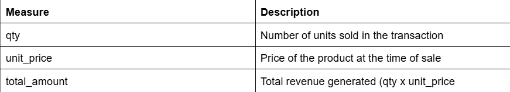
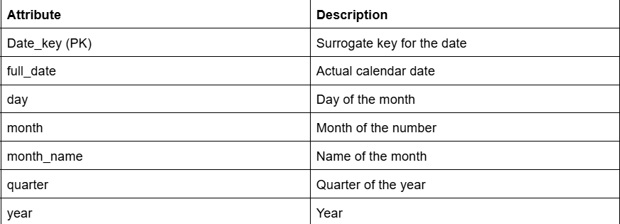
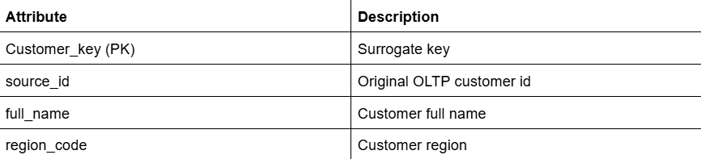
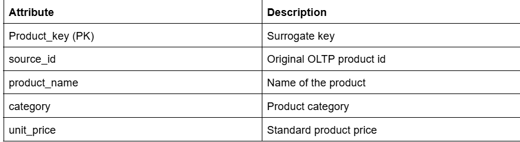
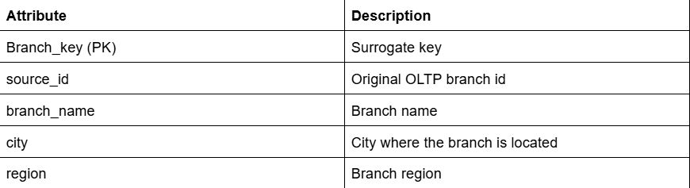

# Activity 8 Answer Template
## Part 1: Star Schema Design

**1. Fact Table Grain**

- The grain of the fact table is one row per product sold per transaction.Each record in the fact_sales table represents a single product purchased by a customer in a specific branch on a specific date. This grain allows the system to accurately track detailed sales activity and supports aggregation for analytical queries such as total revenue per month, product, or region.

**2. Fact Measures**

- The fact_sales table stores the quantitative values used for analysis.



**3. Dimension Tables and Attributes**

dim_date:

- Stores date-related attributes used for time-based analysis.



dim_customer:

- Stores customer information.



dim_product:

- Stores product details.



dim_branch:

- Stores branch/store information.



**4. Relationship Summary**

-The fact_sales table is the central table in the star schema and contains foreign keys that reference the dimension tables.

Relationship:
- fact_sales.date_key → dim_date.date_key

- fact_sales.customer_key → dim_customer.customer_key

- fact_sales.product_key → dim_product.product_key

- fact_sales.branch_key → dim_branch.branch_key

## Part 2: Warehouse DDL

``` sql
CREATE SCHEMA IF NOT EXISTS dw;

CREATE TABLE dw.dim_date (
    date_key SERIAL PRIMARY KEY,
    full_date DATE NOT NULL UNIQUE,
    day INT,
    month INT,
    month_name TEXT,
    quarter INT,
    year INT
);

CREATE TABLE dw.dim_customer (
    customer_key SERIAL PRIMARY KEY,
    source_id INT UNIQUE,  
    full_name TEXT,
    region_code TEXT
);

CREATE TABLE dw.dim_product (
    product_key SERIAL PRIMARY KEY,
    source_id INT UNIQUE, 
    product_name TEXT,
    category TEXT,
    unit_price NUMERIC(10,2)
);

CREATE TABLE dw.dim_branch (
    branch_key SERIAL PRIMARY KEY,
    source_id INT UNIQUE,
    branch_name TEXT,
    city TEXT,
    region TEXT
);

CREATE TABLE dw.fact_sales (

    sales_key SERIAL PRIMARY KEY,

    date_key INT NOT NULL,
    customer_key INT NOT NULL,
    product_key INT NOT NULL,
    branch_key INT NOT NULL,

    qty INT NOT NULL,
    unit_price NUMERIC(10,2) NOT NULL,
    total_amount NUMERIC(12,2) NOT NULL,

    source_txn_id INT UNIQUE, 

    CONSTRAINT fk_date
        FOREIGN KEY (date_key)
        REFERENCES dw.dim_date(date_key),

    CONSTRAINT fk_customer
        FOREIGN KEY (customer_key)
        REFERENCES dw.dim_customer(customer_key),

    CONSTRAINT fk_product
        FOREIGN KEY (product_key)
        REFERENCES dw.dim_product(product_key),

    CONSTRAINT fk_branch
        FOREIGN KEY (branch_key)
        REFERENCES dw.dim_branch(branch_key)
);

CREATE TABLE dw.etl_log (

    log_id SERIAL PRIMARY KEY,
    run_ts TIMESTAMP DEFAULT CURRENT_TIMESTAMP,
    status TEXT,
    rows_loaded INT,
    error_message TEXT

);

CREATE INDEX idx_fact_sales_date
ON dw.fact_sales(date_key);

CREATE INDEX idx_fact_sales_branch
ON dw.fact_sales(branch_key);

CREATE INDEX idx_customer_source
ON dw.dim_customer(source_id);

CREATE INDEX idx_product_source
ON dw.dim_product(source_id);

CREATE INDEX idx_branch_source
ON dw.dim_branch(source_id);
```

## Part 3: ETL Procedure

**1. Procedure Code**

```sql
CREATE OR REPLACE PROCEDURE dw.run_sales_etl()
LANGUAGE plpgsql
AS $$
DECLARE
    v_rows_loaded INT := 0;
BEGIN

    INSERT INTO dw.dim_customer (source_id, full_name, region_code)
    SELECT
        id,
        full_name,
        region_code
    FROM public.customers
    ON CONFLICT (source_id)
    DO UPDATE SET
        full_name = EXCLUDED.full_name,
        region_code = EXCLUDED.region_code;

    INSERT INTO dw.dim_product (source_id, product_name, category, unit_price)
    SELECT
        id,
        product_name,
        category,
        unit_price
    FROM public.products
    ON CONFLICT (source_id)
    DO UPDATE SET
        product_name = EXCLUDED.product_name,
        category = EXCLUDED.category,
        unit_price = EXCLUDED.unit_price;

    INSERT INTO dw.dim_branch (source_id, branch_name, city, region)
    SELECT
        id,
        branch_name,
        city,
        region
    FROM public.branches
    ON CONFLICT (source_id)
    DO UPDATE SET
        branch_name = EXCLUDED.branch_name,
        city = EXCLUDED.city,
        region = EXCLUDED.region;

    INSERT INTO dw.dim_date (full_date, day, month, month_name, quarter, year)
    SELECT DISTINCT
        txn_date,
        EXTRACT(DAY FROM txn_date),
        EXTRACT(MONTH FROM txn_date),
        TO_CHAR(txn_date, 'Month'),
        EXTRACT(QUARTER FROM txn_date),
        EXTRACT(YEAR FROM txn_date)
    FROM public.sales_txn
    ON CONFLICT (full_date) DO NOTHING;

    INSERT INTO dw.fact_sales (
        date_key,
        customer_key,
        product_key,
        branch_key,
        qty,
        unit_price,
        total_amount,
        source_txn_id
    )
    SELECT
        d.date_key,
        c.customer_key,
        p.product_key,
        b.branch_key,
        s.qty,
        s.unit_price,
        s.qty * s.unit_price,
        s.id
    FROM public.sales_txn s
    JOIN dw.dim_date d
        ON d.full_date = s.txn_date
    JOIN dw.dim_customer c
        ON c.source_id = s.customer_id
    JOIN dw.dim_product p
        ON p.source_id = s.product_id
    JOIN dw.dim_branch b
        ON b.source_id = s.branch_id
    WHERE
        s.qty > 0
        AND s.unit_price > 0
        AND NOT EXISTS (
            SELECT 1
            FROM dw.fact_sales f
            WHERE f.source_txn_id = s.id
        );

    GET DIAGNOSTICS v_rows_loaded = ROW_COUNT;

    INSERT INTO dw.etl_log(run_ts, status, rows_loaded, error_message)
    VALUES (CURRENT_TIMESTAMP, 'SUCCESS', v_rows_loaded, NULL);

EXCEPTION
WHEN OTHERS THEN
    INSERT INTO dw.etl_log(run_ts, status, rows_loaded, error_message)
    VALUES (CURRENT_TIMESTAMP, 'FAIL', 0, SQLERRM);

END;
$$;
```

**2. Procedure Execution**

```sql
CALL dw.run_sales_etl();
```

**3. ETL Log Output**

```sql
SELECT *
FROM dw.etl_log
ORDER BY run_ts DESC;
```

## Part 4: Analytical Queries

**Query 1: Monthly Revenue by Branch Region**

```sql
SELECT
    d.year,
    d.month,
    b.region,
    SUM(f.total_amount) AS monthly_revenue
FROM dw.fact_sales f
JOIN dw.dim_date d
    ON f.date_key = d.date_key
JOIN dw.dim_branch b
    ON f.branch_key = b.branch_key
GROUP BY
    d.year,
    d.month,
    b.region
ORDER BY
    d.year,
    d.month,
    monthly_revenue DESC;
```

Interpretation:

- This query calculates the total revenue generated each month for every branch region. It helps management compare regional sales performance and identify which regions generate the most revenue over time.

**Query 2: Top 5 Products by Total Revenue**

```sql
SELECT
    p.product_name,
    SUM(f.total_amount) AS total_revenue
FROM dw.fact_sales f
JOIN dw.dim_product p
    ON f.product_key = p.product_key
GROUP BY
    p.product_name
ORDER BY
    total_revenue DESC
LIMIT 5;
```

Interpretation:

- This query identifies the five products that generate the highest total revenue across all branches. It helps the coffee chain determine their best-selling products and prioritize them in marketing and inventory planning.

**Query 3: Customer Region Contribution to Sales**

```sql
SELECT
    c.region_code,
    SUM(f.total_amount) AS total_sales,
    ROUND(
        SUM(f.total_amount) * 100.0 /
        SUM(SUM(f.total_amount)) OVER (),
        2
    ) AS percentage_contribution
FROM dw.fact_sales f
JOIN dw.dim_customer c
    ON f.customer_key = c.customer_key
GROUP BY
    c.region_code
ORDER BY
    total_sales DESC;
```

Interpretation:

- This query shows how much each customer region contributes to the total company sales. It helps management understand which regions generate the largest share of revenue and where potential market growth opportunities exist.