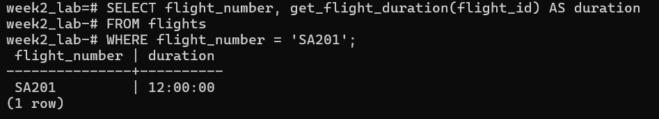
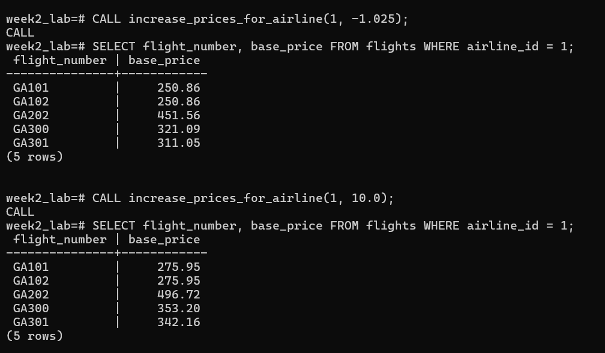

#1 
```sql
SELECT flight_number, get_flight_duration(flight_id) AS duration
FROM flights
WHERE flight_number = 'SA201';
```

#2
```sql
SELECT flight_number, base_price, get_price_category(flight_id)
FROM flights;
```

#3
```sql
-- First, check the number of bookings for flight 1
SELECT COUNT(*) FROM bookings WHERE flight_id = 1;
-- Then, call the procedure to book a new seat
CALL book_flight(3, 1, '14C');
-- Finally, check the count again to see if it increased
SELECT COUNT(*) FROM bookings WHERE flight_id = 1;
```

#4
```sql
-- View prices for Gemini Air (airline_id = 1) before the change
SELECT flight_number, base_price FROM flights WHERE airline_id = 1;

-- Apply a 10% price increase
CALL increase_prices_for_airline(1, 10.0);

-- View the prices again to confirm they have been updated
SELECT flight_number, base_price FROM flights WHERE airline_id = 1;
```
